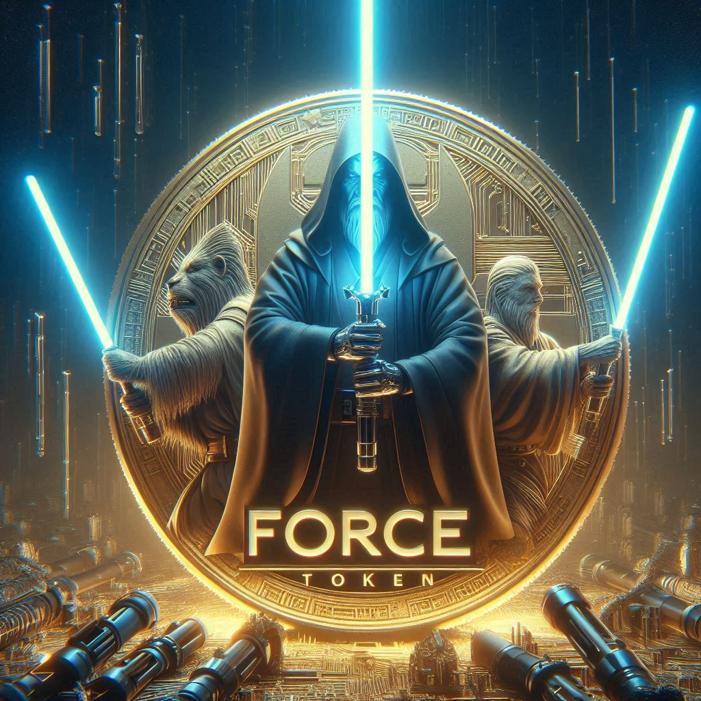

# GalacticGamingDAO

A missão da GalacticGamingDAO é unir e capacitar entusiastas de cripto games, oferecendo um espaço colaborativo e inovador para explorar, aprender e crescer no mundo dos jogos digitais descentralizados.

## FAQ

#### Entrega da DAO

A GalacticGamingDAO se compromete a fornecer educação, recursos e suporte contínuo aos seus membros, promovendo o desenvolvimento de jogos, a participação em competições, e a criação de uma comunidade vibrante e inclusiva onde todos podem prosperar e se divertir

#### Token de Governança

FORCE (Force Token)

#### Membros da Equipe

Estamos entusiasmados em convidá-los para se juntar à nossa equipe na GalacticGamingDAO. Se você é apaixonado por jogos e deseja fazer parte de uma comunidade que compartilha sua paixão, esta é a oportunidade perfeita para você. Junte-se a nós e ajude a moldar o futuro dos cripto games!

## Participação na Governança:

- Como membro da nossa equipe, você terá a oportunidade de influenciar decisões importantes e votar em propostas utilizando nossos FORCE Tokens.
Acesso Exclusivo a Recursos:

- Tenha acesso a tutoriais, webinars e workshops exclusivos que ajudarão você a aprimorar suas habilidades e conhecimentos em cripto games.
Networking e Colaboração:

- Conecte-se com outros entusiastas e especialistas da indústria, colaborando em projetos inovadores e fazendo parte de uma rede de contatos valiosa.
Recompensas e Incentivos:

- Receba recompensas em FORCE Tokens por suas contribuições e participação ativa na comunidade.

## Etiquetas

Adicione etiquetas de algum lugar, como: [shields.io](https://shields.io/)

## Licença

[MIT](https://choosealicense.com/licenses/mit/)

